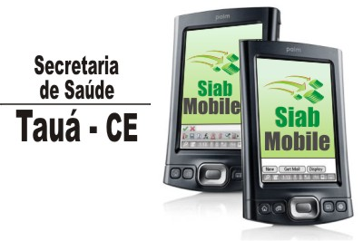
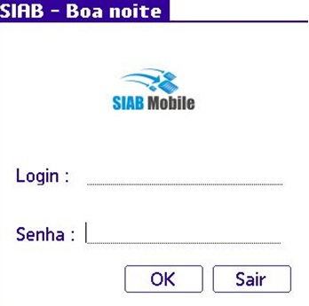
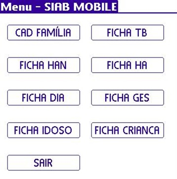
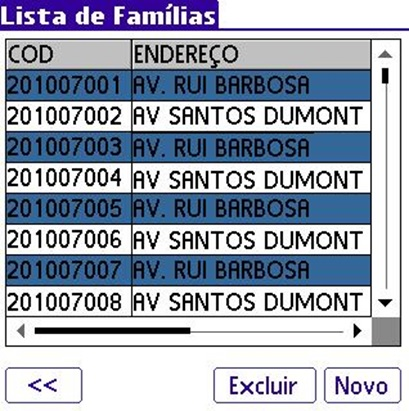

# Siab Mobile

The SIAB is a database (software), the goal is to store and process information about the Family Health strategy, leaving the professional teams of the Family Health strategize, set goals and identify interventions that are necessary in attention of the population and to evaluate the result of the work developed by the team.  
Sistema que coleta informações via smartphone das famílias acompanhadas  pelos agentes de saúde, através de relatórios que  permitirão conhecer a realidade sócio-sanitária da população 

Technologies: TotalCross, Struts MVC, Maven, JavaScript, html, Jsp, CSS, Java, Web Services (Apache Axis) and SQL Server;

 

 
 

Vantagens: 
-Mobilidade. 
-Fácil manipulação dos dados 
-Integridade 
-Validação automática 
-Total integração com o SIAB produzido pelo DATASUS 

#Contatos
Manoel Bibiano da Silva Filho 
Email: bibianofilho@gmail.com

